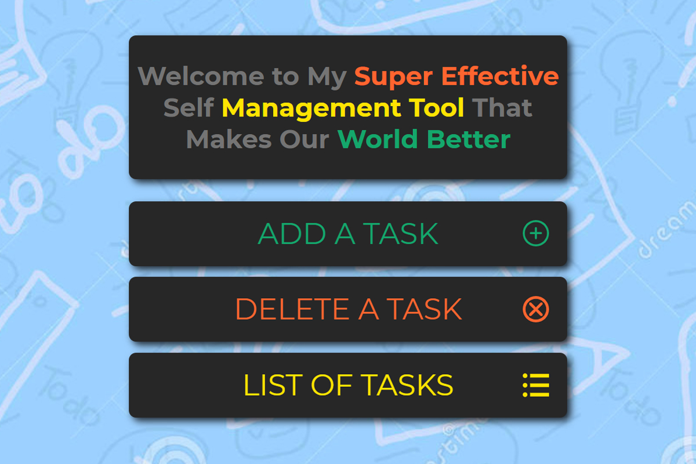

# Self Management Tool

[Link to Demo](http://tool.alexandrpasko.com/)

Self Management Tool is a basic tool that saves activities and due dates of user choice. The list of activities are stored on another web page that is available in another window by clicking a button 'list of tasks'. The logic is built by Vanilla JavaScript. Project's appearence is developed according to design CRAP principles.

## Technologies/Languages:
* JavaScript
* HTML
* CSS
* Photoshop

## Screenshot:
